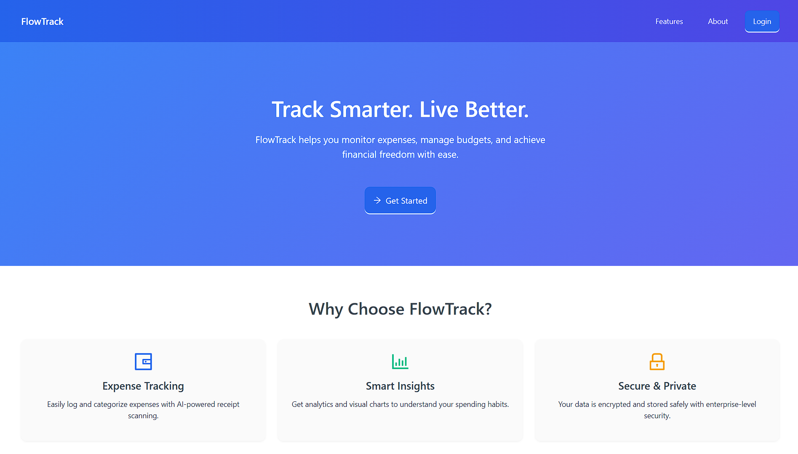

# FlowTrack

Tracking the flow of money... A full-stack application for managing personal finances, receipts, and transactions with OCR capabilities.

## 🎥 Demo Video

[](https://youtu.be/V4z-78XXGTg)

*Click the image above to watch a demo of FlowTrack in action!*

## 🚀 Features

- **User Authentication**: Secure login and signup with JWT tokens
- **Receipt Management**: Upload and parse receipts using OCR (Mindee API)
- **Transaction Tracking**: Record and categorize financial transactions
- **Dashboard**: Visual analytics with charts and insights
- **Responsive UI**: Modern React interface with Ant Design components

## 🛠 Tech Stack

### Backend
- **Node.js** with **Express.js**
- **TypeScript** for type safety
- **MongoDB** with **Mongoose** for data persistence
- **JWT** for authentication
- **Multer** for file uploads
- **Mindee API** for receipt OCR parsing


### Frontend
- **React 19** with **TypeScript**
- **Vite** for fast development and building
- **Ant Design** for UI components
- **Tailwind CSS** for styling
- **React Router** for navigation
- **Axios** for API calls
- **Chart.js** and **Recharts** for data visualization

## 📋 Prerequisites

Before running this application, make sure you have the following installed:

- **Node.js** (v16 or higher)
- **npm** or **yarn**
- **MongoDB** (local installation or cloud service like MongoDB Atlas)
- **Git**

## 🔧 Installation

1. **Clone the repository:**
   ```bash
   git clone <repository-url>
   cd FlowTrack
   ```

2. **Install backend dependencies:**
   ```bash
   cd backend
   npm install
   ```

3. **Install frontend dependencies:**
   ```bash
   cd ../frontend
   npm install
   ```

## ⚙️ Configuration

### Environment Variables

Create a `.env` file in the `backend` directory with the following variables:

```env
PORT=4000
MONGO_URI=mongodb://localhost:27017/flowtrack
JWT_SECRET=your-super-secret-jwt-key
JWT_EXPIRES_IN=3600
UPLOAD_DIR=./uploads
MAX_UPLOAD_SIZE=10485760
MINDEE_API_KEY=your-mindee-api-key
```

### MongoDB Setup

1. **Local MongoDB:**
   - Install MongoDB locally
   - Start MongoDB service
   - Use default connection: `mongodb://localhost:27017/flowtrack`

2. **MongoDB Atlas (Cloud):**
   - Create a cluster on MongoDB Atlas
   - Get your connection string
   - Update `MONGO_URI` in `.env`

### Mindee API Setup

1. Sign up at [Mindee](https://mindee.com/)
2. Get your API key
3. Add it to `MINDEE_API_KEY` in your `.env` file

## 🚀 Running the Application

### Development Mode

1. **Start the backend server:**
   ```bash
   cd backend
   npm run dev
   ```
   The backend will run on `http://localhost:4000`

2. **Start the frontend development server:**
   ```bash
   cd frontend
   npm run dev
   ```
   The frontend will run on `http://localhost:5173` (default Vite port)

### Production Mode

1. **Build the backend:**
   ```bash
   cd backend
   npm run build
   npm start
   ```

2. **Build the frontend:**
   ```bash
   cd frontend
   npm run build
   npm run preview
   ```

## 📜 Available Scripts

### Backend Scripts
- `npm run dev` - Start development server with hot reload
- `npm run build` - Build TypeScript to JavaScript
- `npm start` - Start production server
- `npm run lint` - Run ESLint
- `npm test` - Run Jest tests

### Frontend Scripts
- `npm run dev` - Start Vite development server
- `npm run build` - Build for production
- `npm run preview` - Preview production build
- `npm run lint` - Run ESLint

## 📁 Project Structure

```
FlowTrack/
├── backend/
│   ├── src/
│   │   ├── config/          # Configuration files
│   │   ├── controllers/     # Route controllers
│   │   ├── middlewares/     # Express middlewares
│   │   ├── models/          # MongoDB models
│   │   ├── routes/          # API routes
│   │   ├── app.ts           # Express app setup
│   │   └── server.ts        # Server entry point
│   ├── uploads/             # File uploads directory
│   ├── package.json
│   └── tsconfig.json
├── frontend/
│   ├── src/
│   │   ├── api/             # API service functions
│   │   ├── assets/          # Static assets
│   │   ├── components/      # Reusable components
│   │   ├── features/        # Feature-specific components
│   │   ├── hooks/           # Custom React hooks
│   │   ├── routes/          # Routing configuration
│   │   ├── styles/          # Global styles
│   │   ├── types/           # TypeScript type definitions
│   │   ├── App.tsx          # Main app component
│   │   └── main.tsx         # App entry point
│   ├── public/              # Public assets
│   ├── index.html
│   ├── package.json
│   └── vite.config.ts
├── package.json
└── README.md
```

## 🔌 API Endpoints

### Authentication
- `POST /api/auth/register` - User registration
- `POST /api/auth/login` - User login

### Transactions
- `GET /api/transactions` - Get all transactions
- `POST /api/transactions` - Create new transaction
- `PUT /api/transactions/:id` - Update transaction
- `DELETE /api/transactions/:id` - Delete transaction

### Receipts

- `POST /api/receipts` - Upload new receipt


## 🧪 Testing

### Backend Tests
```bash
cd backend
npm test
```

### Frontend Tests
```bash
cd frontend
npm test
```

This project is licensed under the ISC License.

## 📞 Support

If you have any questions or need help, please open an issue in the repository.

---

**Happy tracking your financial flow! 💰**
